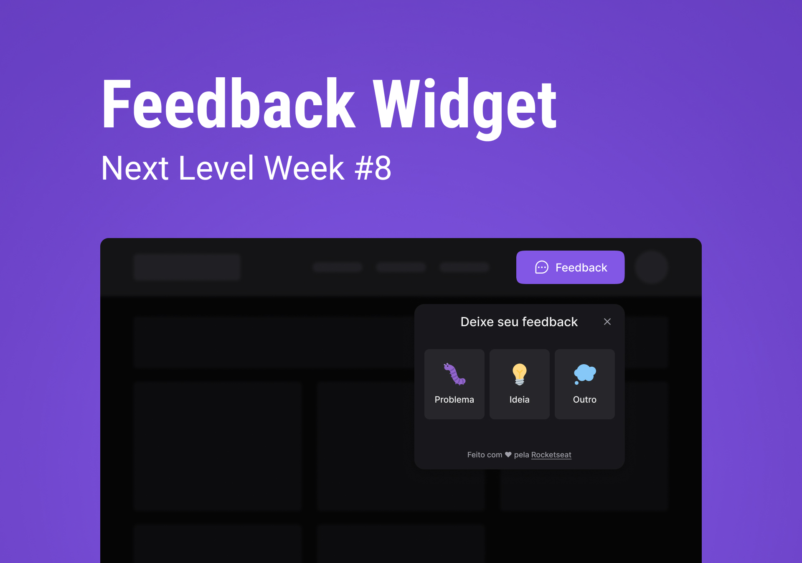

    

<h1 align="center">
	NLW Return Impulse by Rockeseat.
</h1>

Trilha Impulse do NLW Return.

  

  

## 📁 Projeto

Um Component Widget para feedbacks realizado durante o evento NLW Return transmitido pela [Rocketseat](https://www.rocketseat.com.br/).

Cada parte do projeto (front-end, back-end e mobile) estão separados em diretórios diferentes.

## 🛠 Tecnologias

- [Web 🌐](./web):
  - [ReactJS](https://pt-br.reactjs.org/)
  - [Phosphor Icons](https://phosphoricons.com/)
  - [Tailwindcss](https://tailwindcss.com/)
  - React Boilerplate 🧱
    - [Vite](https://vitejs.dev/)
- [Server 💻](./server):
  - [NodeJS](https://nodejs.org/pt-br/)
  - [Express](https://expressjs.com/pt-br/)
  - [Axios](https://axios-http.com/ptbr/docs/intro)
  - [Prisma](https://www.prisma.io/)
  - [Jest](https://jestjs.io/pt-BR/)
  - [SQlite](https://www.sqlite.org/index.html)
  - Outras Tecnologias ⚙
    - [Mailtrap](https://mailtrap.io/)
- [Mobile 📱](./mobile):
  - [React Native](https://reactnative.dev/)
  - [Expo](https://expo.dev/)

## 🚀 **Em constante evolução...**

---

Feito com ♥ by [Daniel Corona](https://www.linkedin.com/in/dnlcorona/)